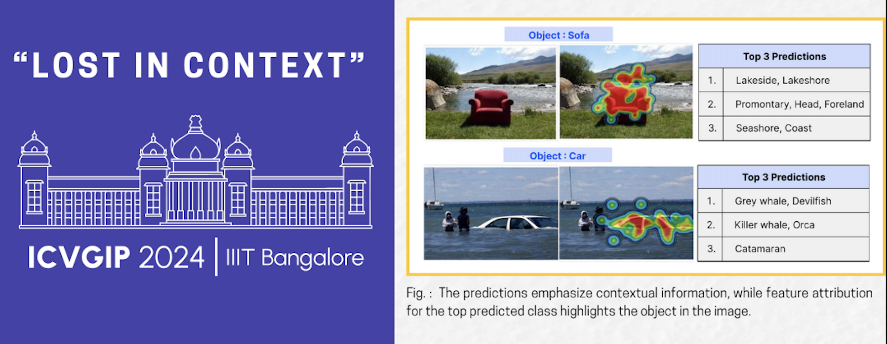

# Lost in Context: The Influence of Context on Feature Attribution Methods for Object Recognition  
**Accepted at ICVGIP 2024**

[](https://arxiv.org/abs/2202.05822s)


## Overview




This repository contains the code and supplementary materials for our paper *"Lost in Context: The Influence of Context on Feature Attribution Methods for Object Recognition,"* accepted at ICVGIP 2024. Our research highlights the significant impact of context on feature attribution methods used in explaining object recognition models, providing insights into the vulnerabilities of these techniques in real-world scenarios.

## Abstract

Contextual elements can heavily bias feature attribution methods, leading to unreliable interpretations and reducing the trustworthiness of AI systems. We present a comprehensive analysis of how these biases manifest and offer guidance for developing more robust and context-aware explainability frameworks.

---

## 📂 Contents

- **`code/`**: Python scripts and modules for running experiments.
- **`data/`**: Sample datasets used in our analysis.
- **`metric/`**: Metrics calculation scripts with explanations:
  - `M1-metric-object_context-attribution-correct.py`: Evaluates correctly classified images.
  - `M5-metric-object_context-attribution-noises-paper.py`: Assesses performance under noise conditions.
- **`utils/`**: Utility scripts and data files:
  - `imagenet_class_index.json`: Contains ImageNet class labels and indices.
- **`environment.yml`**: Conda environment setup file.

---

## 🛠 Installation

1. **Clone the repository**:
   ```bash
   git clone https://github.com/nineRishav/Lost-In-Context.git

2. **Install Dependency**
    ```bash
    pip install -r requirements.txt


## 🗂️ Directory Structure

- `metric/`: Contains scripts for calculating various metrics related to image classification.
  - `M1-metric-object_context-attribution-correct.py`: Calculates metrics for correctly classified images.
  - `M5-metric-object_context-attribution-noises-paper.py`: Calculates metrics for images with noise variants.
  - ... (list other relevant scripts with brief descriptions)
- `utils/`: Utility scripts and JSON files used across the project.
  - `imagenet_class_index.json`: JSON file containing ImageNet class indices.
  - ... (list other relevant utility files)
- `environment.yml`: Conda environment configuration file that lists all dependencies required to run the code.


## 📜 Citation
If you make use of our work, please cite our paper:

```
@inproceedings{adhikari2024lostincontext,
  title={Lost in Context: The Influence of Context on Feature Attribution Methods for Object Recognition},
  author={Adhikari, Sayanta and Kumar, Rishav and Mopuri, KR and Rajalakshmi, P},
  booktitle={Proceedings of the Indian Conference on Computer Vision, Graphics and Image Processing (ICVGIP)},
  year={2024}
}

```